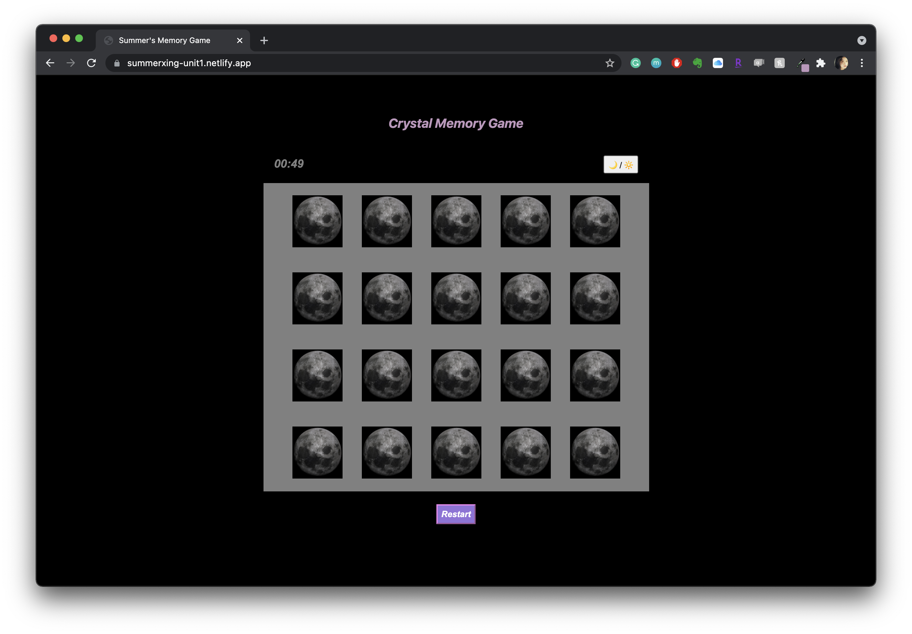
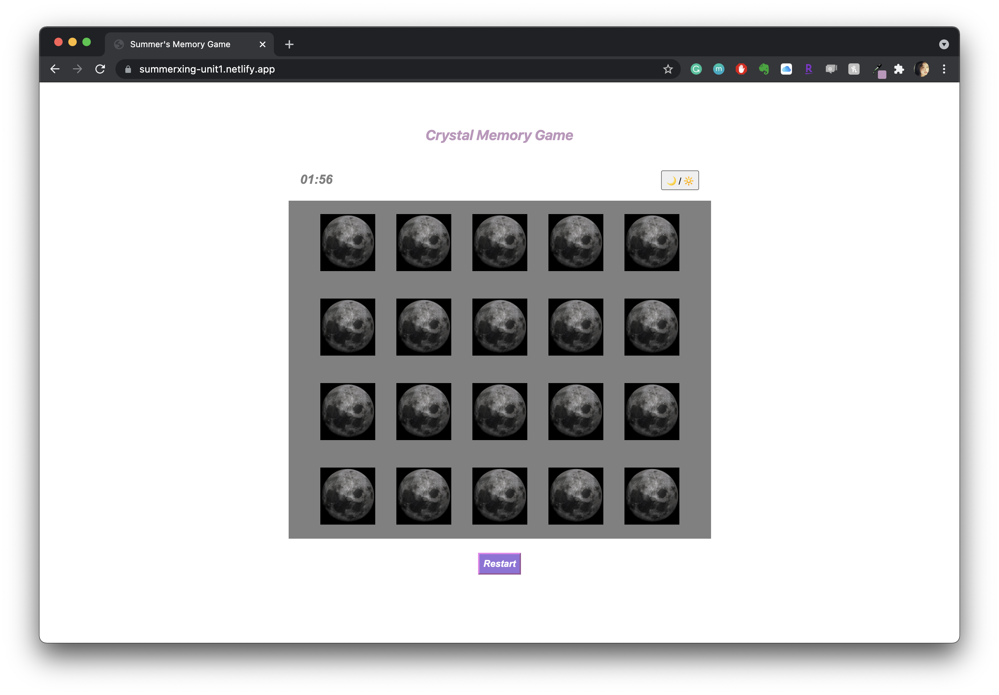

# Memory Game
-------------------------------------------------------
# [Click to play the game](https://summerxing-unit1.netlify.app/)
-------------------------------------------------------
# Motivation: 
- For my first project, I want to create something where I can practice what we have learned in Unit 1 so far and be comfortable with all the material. 
-------------------------------------------------------
# Decription: 
- It's a memory game where one player tries to find matching images. 
- There are 2 x 10 = 20 cards in the game.
- If the players clicks on the same images (finds the pair)consecutively , the images stay face-up. 
- If he/she finds all the pairs within 2 minutes, it's a win. Otherwise, he/she loses. 
- * Need to click on the Restart button to play the game

-------------------------------------------------------

# Technologies Used: 
- JS, HTML, CSS

-------------------------------------------------------
 # Dark-light Mode:
 
 

-------------------------------------------------------
# Psudo-code

- HTML:
  - Create 2 headers for the game's name and displayed messages
  - Create a container to display a timer and a dark/light mode button
  - Create a gameboard with 20 images and assign back-side/front-side to them
  - Create a restart button

- JS:
  - Define variables/state
    - firstCard = the first card that a player clicks on
    - secondCard = the second card that a player clicks on
    - delay = a time lapse when a card flips back 
    - win = if the player wins the game
    - countMatch = counts how many matches the plays have already
  - Define Cached Element References
    - restartBtn = the restart button
    - lightDarkBtn = the light/dark mode switch
    - message = a message that displays if the player wins or loses
    - cards = the images/cards on the game board
  - Define Event Listeners
    - click to flip the card
    - click to restart the game
    - click to switch between light/dark mode
  - Define Functions
    - Create a function to flip the card
      - determine if it's the first or second card
      - counts the number of matches if there is a match
      - the cards flip back to their original state if it's not a match
      - restart all the functions when a restart button is clicked
      - determine the win condition
    - Create a function for the light/dark mode

- CSS
  - Should clip over the cards
  - Format the buttons and headers

-------------------------------------------------------
# Future Improvements:
  - make it prettier
  - Add audio

